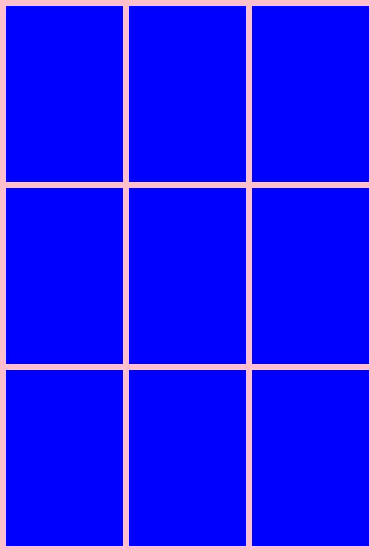
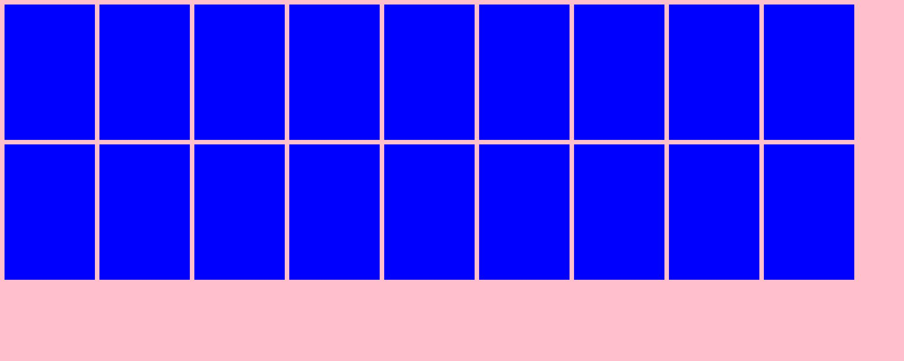
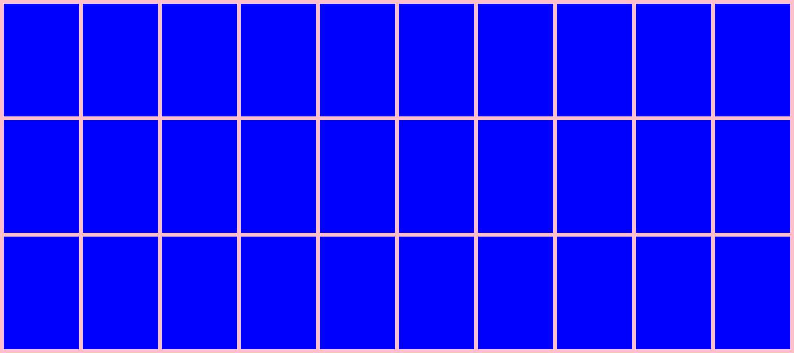

photo-layout
============

根据图像进行排版。比如排成二行三列的布局。

安装
----

.. code:: cmd

   pip install photo-layout

对象相关描述
------------

::

   Canvas(width=None, height=None, color="white", is_del_extra=False)

-  ``width``: 画布的宽度。
-  ``height``: 画布的高度。
-  ``color``: 画布的颜色。默认为白色\ ``white``\ 。
-  ``is_del_extra``\ ：是否删除画布中额外多出的部分。

::

   LayoutModel(canvas=Canvas, imagePath=None, row, column, space=10)

-  ``canvas``: ``Canvas``\ 对象。
-  ``imagePath``\ ：本地的图片路径。
-  ``row``\ ：行数。
-  ``column``\ ：列数。
-  ``space``\ ：间距。默认为\ ``10``\ 。

示例一
------

.. code:: python

   from photo_layout.layout import Canvas, LayoutModel
   from photo_layout.image import LayoutImage

   def main():
       canvas = Canvas(color="pink")
       layout_model = LayoutModel(canvas=canvas, imagePath="test.jpg", row=3, column=3, space=10)
       layout_image = LayoutImage(layout=layout_model)
       image = layout_image.create()
       image.show()

   if __name__ == '__main__':
       main()

效果图如下：

当然你也可以调用\ ``image.save("imgs/example1.jpg")``\ 来保存到本地。

示例二
------

   根据图片来填充整个画布.

.. code:: python

   from photo_layout.layout import Canvas, LayoutModel
   from photo_layout.image import LayoutImage

   def main():
       canvas = Canvas(width=2000, height=800, color="pink")
       layout_model = LayoutModel(canvas=canvas, imagePath="test.jpg", space=10)
       layout_image = LayoutImage(layout=layout_model)
       image = layout_image.create()
       image.show()

   if __name__ == '__main__':
       main()

效果图如下：

示例三
------

   根据图片来填充整个画布.
   通过设置\ ``is_del_extra=True``\ 来删除画布额外多出的部分。

.. code:: python

   from photo_layout.layout import Canvas, LayoutModel
   from photo_layout.image import LayoutImage

   def main():
       canvas = Canvas(width=2000, height=800, color="pink", is_del_extra=True)
       layout_model = LayoutModel(canvas=canvas, imagePath="test.jpg", space=10)
       layout_image = LayoutImage(layout=layout_model)
       image = layout_image.create()
       image.show()

   if __name__ == '__main__':
       main()

效果图如下：

